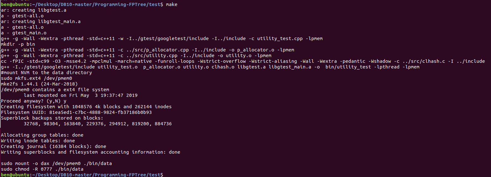
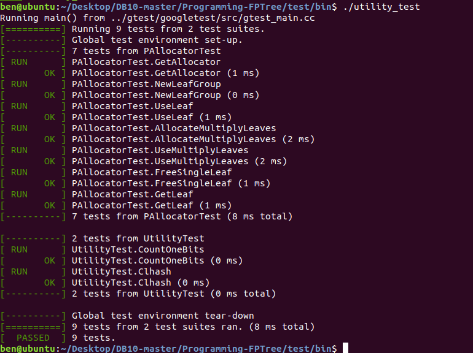
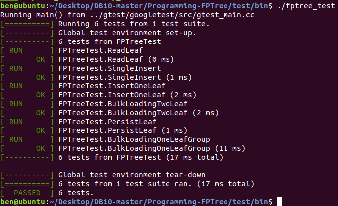

###  系统说明书

本次课程设计基于针对NVM优化的数据结构FPTree，实现一个简单的键值存储引擎FPTreeDB。我们通过在pmem库的基础上将其包装成一个调用库，供用户程序使用并管理其数据存储，与LevelDB的使用方式类似。用户可以不用关心底层的NVM+DRAM内存是如何分配管理的。
其对外可用的对数据的基本操作主要就是增删改查,也是我们要实现的主要的api：

```c++
virtual KeyNode* insert(const Key& k, const Value& v) 
virtual bool remove(const Key& k, const int& index, InnerNode* const& parent, bool &ifDelete)
virtual bool update(const Key& k, const Value& v) 
virtual Value find(const Key& k) 
```
### 时间实现计划
系统说明书，PAllocator实现并通过utility测试，LevelDB的使用以及测试，对应lycsb.cpp，p_allocator.cpp的实现和运行，utility_test.cpp的运行 --- 5/4晚前发布v1版本branch(不会分支的自学)(20分)
FPTreeDB插入和重载操作并通过相关测试，对应fptree.cpp的实现和fptree_test.cpp部分的运行 --- 5/11晚前发布v2版本branch(30分)
FPTreeDB查询和更新操作并通过相关测试，对应fptree.cpp的实现和fptree_test.cpp部分的运行 --- 5/18晚前发布v3版本branch(10分)
FPTreeDB删除操作和所有剩下实现以及测试，对应fptree.cpp的实现和fptree_test.cpp所有的运行 --- 5/31晚前发布final版本branch，作为最后发布版本(40分)

主要按照TA给出的时间表来进行实现，首先是实现底层的NVM内存分配，然后是类B+树的增删改查操作的实现。

### 系统运行和测试简介

如果要编写自己的程序调用我们的fptree库，首先需要提前安装pmem和pthread在标准库中，接着在main程序中#include"fptree.h"同时与fptree实现相关的clhash.c，utility.cpp，p_allocator.cpp联合进行动态链接编译得到主程序。

#### v1 Branch 运行与测试
v1 Branch 中主要实现的是，PAllocator实现并通过utility测试，LevelDB的使用以及测试，对应lycsb.cpp，p_allocator.cpp的实现和运行，utility_test.cpp的运行

v1相关联的文件目录说明：  (TODO为需要修改的文件)
```
|__include: 
   |__utility: 
      |__utility.h: 需改动常量(TODO)  
      |__clhash.h: 
      |__p_allocator.h:  
|__src: 
   |__bin:
      |__lycsb: lycsb.cpp的可执行文件 
   |__clhash.c: 
   |__p_allocator.cpp: NVM内存分配器源文件(TODO)  
   |__lycsb.cpp: LevelDB的YCSB测试代码(TODO)   
   |__makefile: src下项目的编译文件(TODO)  
|__workloads: 
   |__数据量-rw-读比例-写比例-load.txt:  
   |__数据量-rw-读比例-写比例-run.txt:  
|__test: 
   |__bin: 
      |__utility_test: utility_test.cpp的可执行文件 
      |__data: NVM挂载的文件夹
   |__utility_test.cpp: 
   |__makefile: gtest单元测试的编译文件(TODO)  
```

##### LevelDB的使用以及测试
注意在此测试之前，必须先编译安装**leveldb**，同时**make install**将leveldb安装到**本地标准库**中，同时在编译中加入--lleveldb -lpthread选项。相关的编译语句已在makefile中写好。cd进入项目的src文件夹，在命令行中make，便会在/src/bin/中生成可执行的lycsb可执行文件。相关操作及测试结果如下所示：

```shell
		#make sure leveldb has installed
		cd src
		make
		cd bin
		./lycsb
```


程序默认在运行路径下新建一个leveldb文件夹作为leveldb数据存放点。
程序默认使用220w-rw-50-50-load.txt和220w-rw-50-50-run.txt进行测试，
若要更改使用的负载文件，在./src/p_allocator.cpp中更改以下常量，包括文件名以及操作数量。

``` C++
const string load = workload + "220w-rw-50-50-load.txt"; // TODO: the workload_load filename
const string run  = workload + "220w-rw-50-50-run.txt"; // TODO: the workload_run filename
const int READ_WRITE_NUM = 350000; // TODO: how many operations
```
##### p_allocator.cpp的实现和运行，utility_test.cpp的运行 
p_allocator.cpp本身只实现了一个类，要运行需要一层外层的main函数进行包装运行。这里我们采用Google Test对p_allocator.cpp的实现进行运行验证。相关的编译语句已在makefile中写好。具体操作方法如下：
cd进入项目的test文件夹，在命令行中make，便会在./test/bin/中生成可执行的utility_test可执行文件。相关操作及测试结果如下所示：

```shell
		cd test
		make
		cd bin
		./utility_test
```


make时首先是将google test的源文件以及p_allocator.cpp进行联合编译生成bin文件下的一个可执行utility_test文件，同时在bin文件下生成一个data文件夹，将NVM挂载到该文件夹中，同时修改该文件夹的权限为0777。p_allocator分配的catalog，freelist，leaf group等文件都会在data文件夹存放。
**注意有些操作需要sudo权限**

```
|__test: 
   |__bin: 
      |__utility_test: utility_test.cpp的可执行文件 
      |__data: NVM挂载的文件夹
```



接着运行utility_test进行google test，可以看到9个样例全部通过。

如果要删除之前编译的结果或者重新挂载NVM，可直接在src或test make clean，清除对应的生成文件。相关的makefile语句已经写好。     

``` shell
		#用于删除文件或解除挂载
		make clean
```


#### v2  Branch 运行与测试
v2主要实现的是树的插入和重载。对于插入，我们使用google test进行测试。对于重载，我们在bin中生成main可执行文件进行测试。

**WARNING:编译过程中make 可能出现Error，但Error不一定是致命错误，会被ignored掉，继续make，不代表可执行文件没有生成。
如果没有生成对应的可执行文件。则返回进行make clean的操作。
通常make错误是由重复挂载NVM，挂载NVM失败，解除一个没有挂载的NVM引起的
make clean可以清除对应项目的data文件夹并解除挂载
data文件夹默认为挂载NVM的文件夹，挂载NVM默认指定设备/dev/pmem0，请确保NVM内存至少存在一块（即pmem0）
make时有些语句需要root权限**

##### main可执行文件的测试
```shell
		#make sure leveldb has installed
		cd src
		make
		cd bin
		./main
```


#### FPTREE_TEST测试
```shell
		#make sure leveldb has installed
		cd test
		make
		cd bin
		./fptree_test
```


#### v3 Branch 运行与测试
由于v2已经实现了find()函数，实际上v3只是简单地实现了update()函数，而主要增加的可执行内容是fptree_test中的update测试。具体编译使用与v2相同。
#### FPTREE_TEST测试
```shell
		#don't be confused about Error[ignored],just ignored it
		#this happens because we unmount dev/pmem0 firstly no matter
        	#it's whether mounted or not.If not,it could still 
		#run and finish compliing.
		cd test
		make
		cd bin
		./fptree_test
```

Update测试结果


